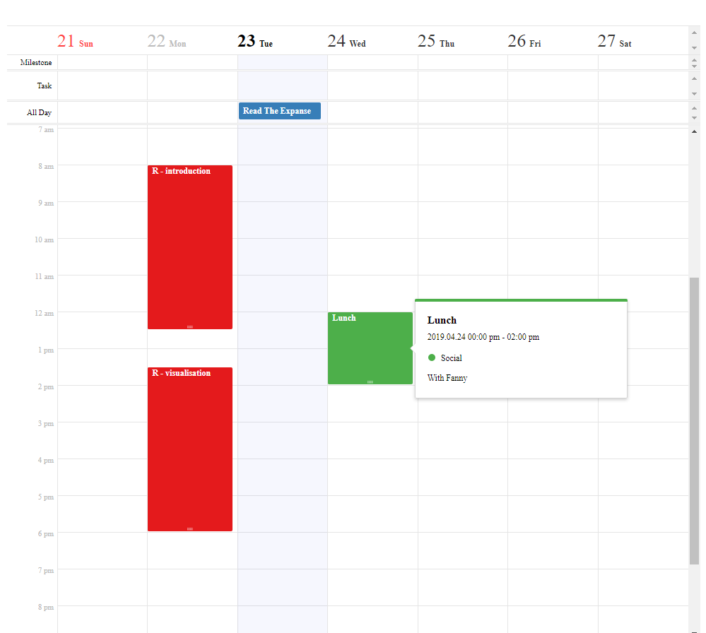
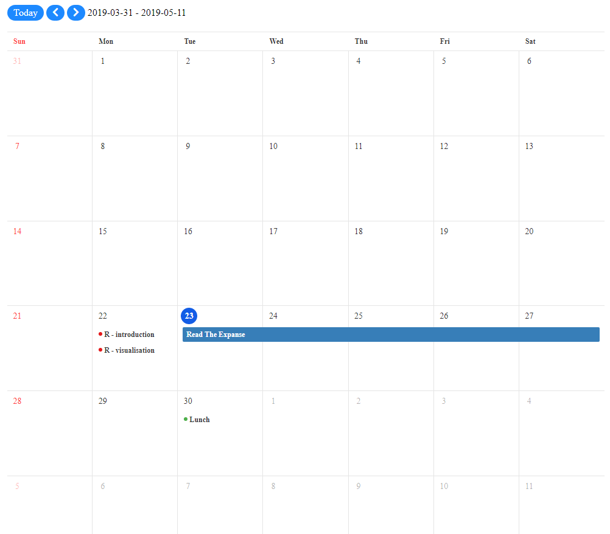

# tuicalendr

> Htmlwidget to create interactive calendar with JavaScript library [tui-calendar](https://github.com/nhn/tui.calendar)

<!-- badges: start -->
[](https://www.tidyverse.org/lifecycle/#experimental)
[](https://www.repostatus.org/#active)
[](https://travis-ci.org/dreamRs/tuicalendr)
[](https://github.com/dreamRs/tuicalendr/actions)
<!-- badges: end -->


## Installation

You can install from GitHub with:

```r
remotes::install_github("dreamRs/tuicalendr")
```

## Examples

Weekly calendar:

```r
library(tuicalendr)
calendar(defaultView = "week", taskView = TRUE, scheduleView = c("time", "allday")) %>% 
  set_calendars_props(id = "courses", name = "Courses", color = "#FFF", bgColor = "#E41A1C") %>% 
  set_calendars_props(id = "hobbies", name = "Hobbies", color = "#FFF", bgColor = "#377EB8") %>% 
  set_calendars_props(id = "social", name = "Social", color = "#FFF", bgColor = "#4DAF4A") %>% 
  add_schedule(
    calendarId = "courses",
    title = "R - introduction", 
    body = "What is R?",
    start = sprintf("%s 08:00:00", Sys.Date() - 1),
    end = sprintf("%s 12:30:00", Sys.Date() - 1),
    category = "time"
  ) %>% 
  add_schedule(
    calendarId = "courses",
    title = "R - visualisation", 
    body = "With ggplot2",
    start = sprintf("%s 13:30:00", Sys.Date() - 1),
    end = sprintf("%s 18:00:00", Sys.Date() - 1),
    category = "time"
  ) %>% 
  add_schedule(
    calendarId = "hobbies",
    title = "Read The Expanse", 
    body = "Vol. 5 : Nemesis Games",
    start = Sys.Date(),
    end = Sys.Date(),
    category = "allday"
  ) %>% 
  add_schedule(
    calendarId = "social",
    title = "Lunch", 
    body = "With Fanny",
    start = sprintf("%s 12:00:00", Sys.Date() + 1),
    end = sprintf("%s 14:00:00", Sys.Date() + 1),
    category = "time"
  )
```



Month calendar:

```r
calendar(defaultView = "month", taskView = TRUE, scheduleView = c("time", "allday"), useNav = TRUE) %>% 
  set_calendars_props(id = "courses", name = "Courses", color = "#FFF", bgColor = "#E41A1C") %>% 
  set_calendars_props(id = "hobbies", name = "Hobbies", color = "#FFF", bgColor = "#377EB8") %>% 
  set_calendars_props(id = "social", name = "Social", color = "#FFF", bgColor = "#4DAF4A") %>% 
  add_schedule(
    calendarId = "courses",
    title = "R - introduction", 
    body = "What is R?",
    start = sprintf("%s 08:00:00", Sys.Date() - 1),
    end = sprintf("%s 12:30:00", Sys.Date() - 1),
    category = "time"
  ) %>% 
  add_schedule(
    calendarId = "courses",
    title = "R - visualisation", 
    body = "With ggplot2",
    start = sprintf("%s 13:30:00", Sys.Date() - 1),
    end = sprintf("%s 18:00:00", Sys.Date() - 1),
    category = "time"
  ) %>% 
  add_schedule(
    calendarId = "hobbies",
    title = "Read The Expanse", 
    body = "Vol. 5 : Nemesis Games",
    start = Sys.Date(),
    end = Sys.Date() + 4,
    category = "allday"
  ) %>% 
  add_schedule(
    calendarId = "social",
    title = "Lunch", 
    body = "With Fanny",
    start = sprintf("%s 12:00:00", Sys.Date() + 7),
    end = sprintf("%s 14:00:00", Sys.Date() + 7),
    category = "time"
  )
```



